# 基于Ubuntu20.04系统的无人值守安装

## 实验目的
* 学会在官网下载并手动安装ubuntu系统
* 利用ssh远程控制虚拟机并进行文件的相互传输
* 借助genisoimage制作ISO镜像文件

## 实验环境
* Virtualbox(6.1版本)
* Ubuntu 20.04 Server 64bit

## 实验过程
1. 在官网上下载ubuntu-20.04.2-live-sever-amd64.iso文件，并进行手动安装, 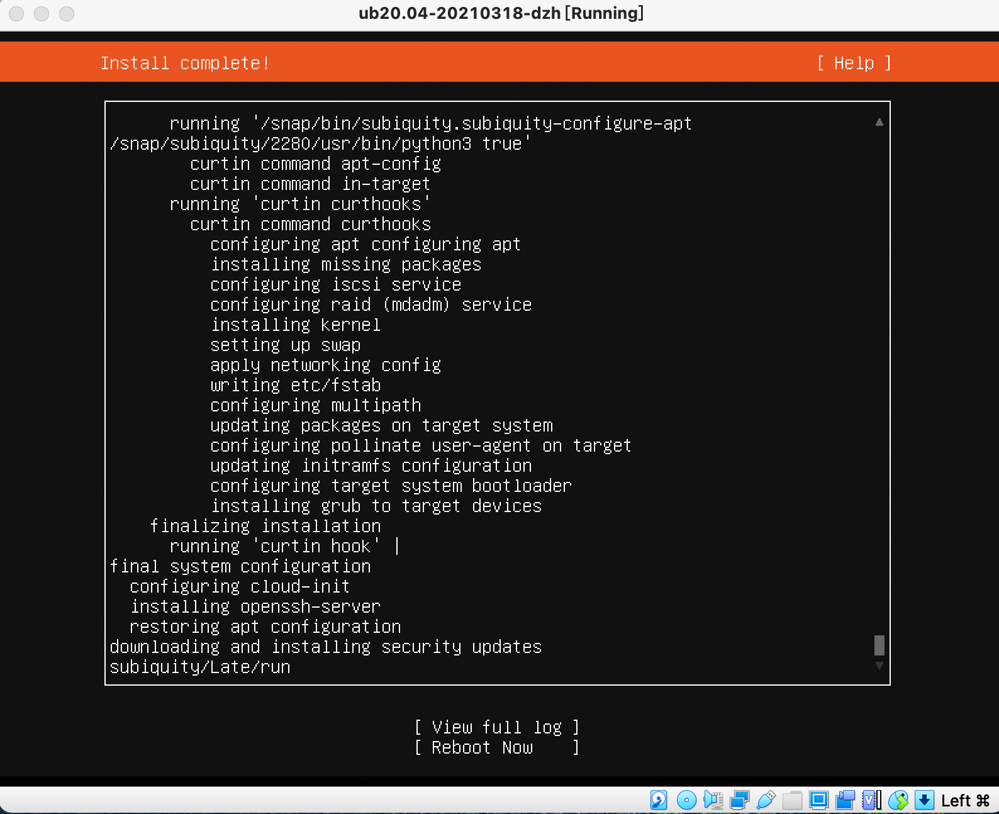, 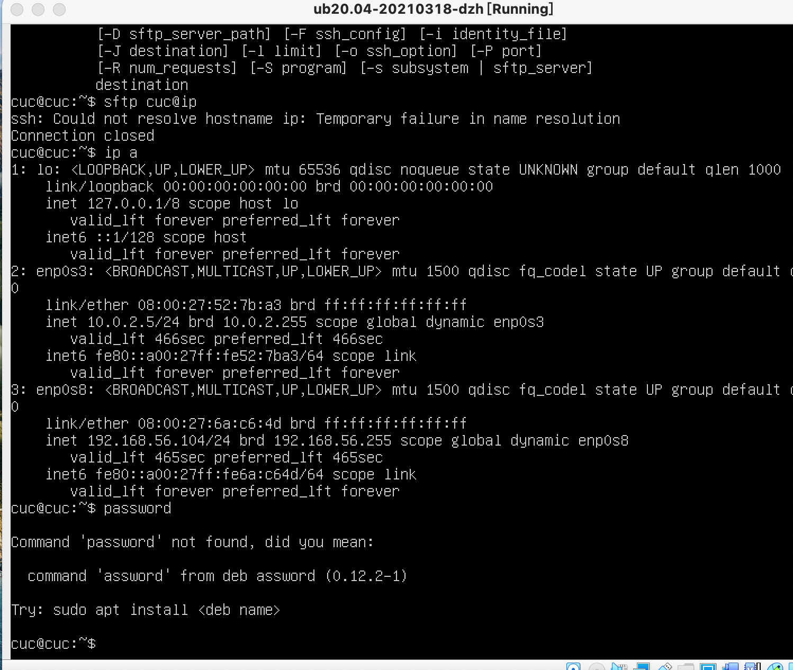
2. 在终端借助ssh和linux系统连接, 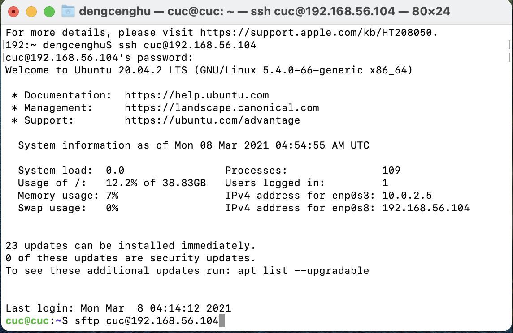,然后通过chown给cuc用户授予获取文件的权限
   
   ```
       sudo chown cuc:cuc /var/log/installer/autoinstall-user-data
   ```
   接着通过scp将autoinstall-user-data文件下载至本地, 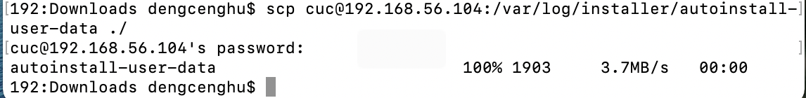
3. 将获取的文件与示例文件及老师提供的配置文件进行比对修改，并创建meta-data的空文件, ,,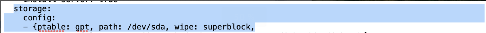,,
4. 将修改好的user-data与meta-data文件导入提前在虚拟机创建好的data文件夹中（注意，若直接将文件导入虚拟机，那文件将淹没在系统的“海洋”中，无法查询）,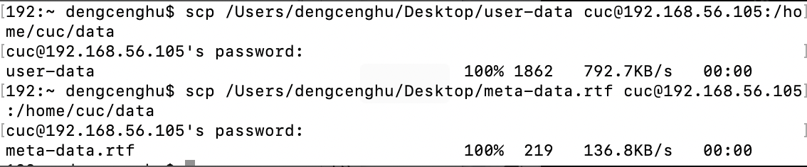
5. 参考番外章节，制作包含user-data和meta-data的iso镜像文件
   ```
       genisoimage -output init.iso -volid cidata -joliet -rock user-data meta-data
   ```
* 安装依赖工具 ,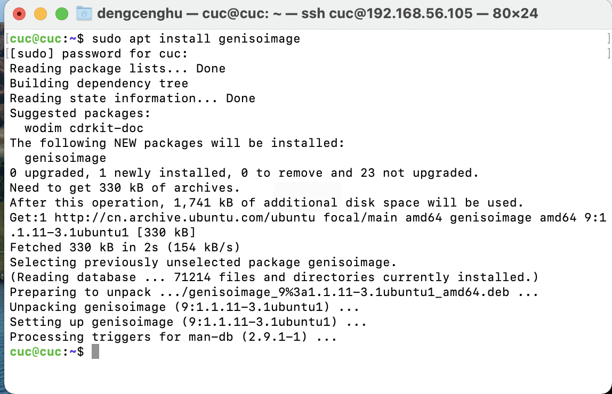
* 创建cloud-init镜像(注意，创建镜像时，需要先进入创建的date文件夹的目录，否则找不到文件) ,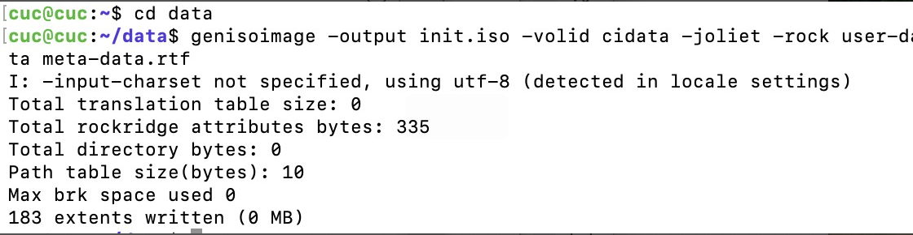
* 将init镜像传输到本地 ,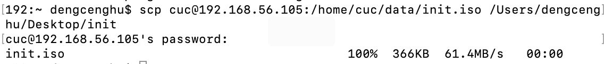
6. 新建可以用于安装Ubuntu 64位系统的虚拟机，移除上述虚拟机「设置」-「存储」-「控制器：IDE」，在「控制器：SATA」下新建 2 个虚拟光盘，按顺序 先挂载「纯净版 Ubuntu 安装镜像文件」后挂载init.iso ,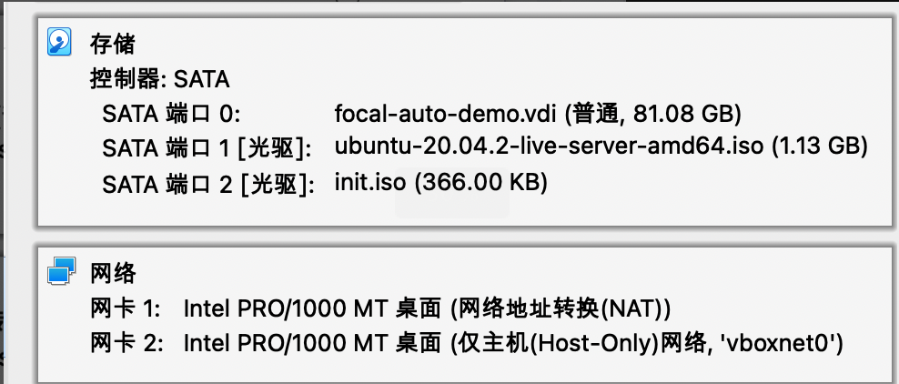
7. 启动虚拟机，开始进行无人值守安装 ,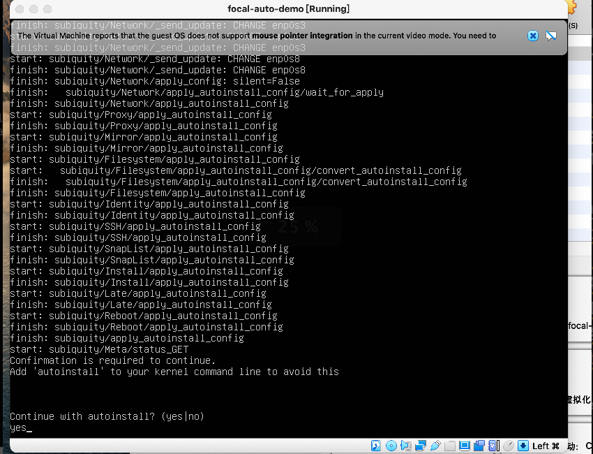,稍等片刻系统重启，就完成了无人值守 ,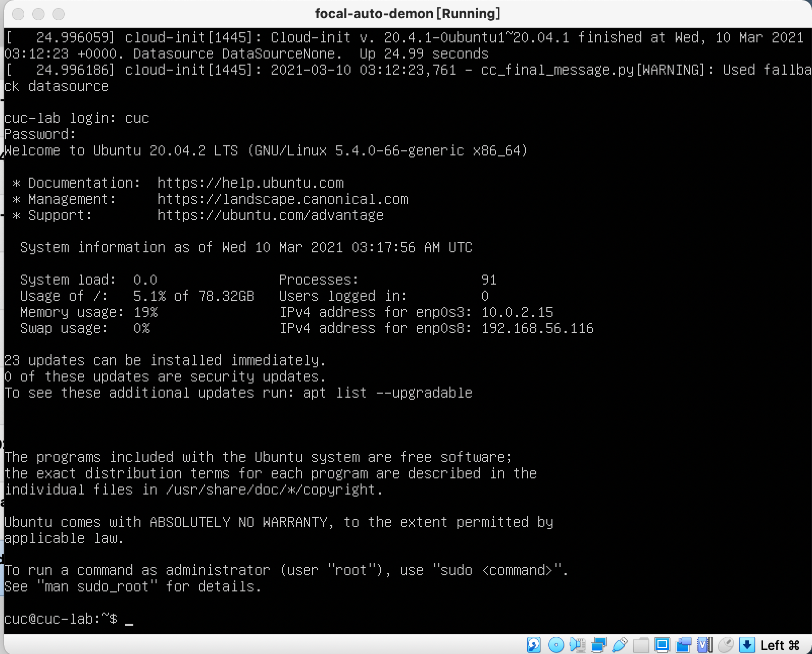