# 第四章：shell脚本编程基础

## 实验环境
* Ubuntu 20.04
* mac os
* imagemagick
  
## 实验目的
#### 任务一：用bash编写一个图片批处理脚本，实现以下功能：
  
 - [x] 支持命令行参数方式使用不同功能
 - [x] 支持对指定目录下所有支持格式的图片文件进行批处理
 - [x] 支持以下常见图片批处理功能的单独使用或组合使用
    - [x] 支持对jpeg格式图片进行图片质量压缩
    - [x] 支持对jpeg/png/svg格式图片在保持原始宽高比的前提下压缩分辨率
    - [x] 支持对图片批量添加自定义文本水印
    - [x] 支持批量重命名（统一添加文件名前缀或后缀，不影响原始文件扩展名）
    - [x] 支持将png/svg图片统一转换为jpg格式图片

#### 任务二：用bash编写一个文本批处理脚本，对以下附件分别进行批量处理完成相应的数据统计任务：

 - [x] 统计不同年龄区间范围（20岁以下、[20-30]、30岁以上）的球员数量、百分比
 - [x] 统计不同场上位置的球员数量、百分比
 - [x] 名字最长的球员是谁？名字最短的球员是谁？
 - [x] 年龄最大的球员是谁？年龄最小的球员是谁？

#### 任务三：用bash编写一个文本批处理脚本，对以下附件分别进行批量处理完成相应的数据统计任务：

 - [x] 统计访问来源主机TOP 100和分别对应出现的总次数
 - [x] 统计访问来源主机TOP 100 IP和分别对应出现的总次数
 - [x] 统计最频繁被访问的URL TOP 100
 - [x] 统计不同响应状态码的出现次数和对应百分比
 - [x] 分别统计不同4XX状态码对应的TOP 10 URL和对应出现的总次数
 - [x] 给定URL输出TOP 100访问来源主机

## 实验步骤

#### 任务一
1. 根据老师视频的提示，提前安装好```imagemagick```和```shellcheck```,并利用scp上传实验图片
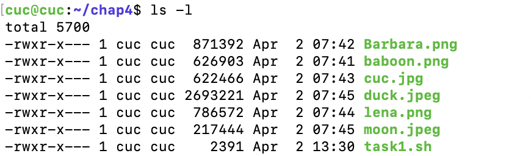

2. 编写脚本
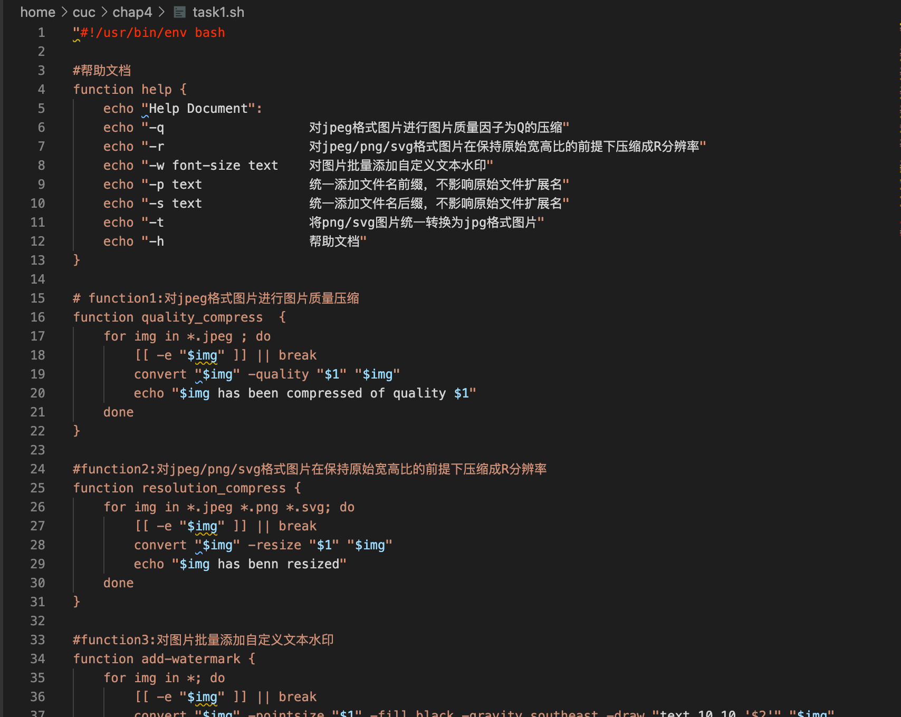

3. 测试编程结果
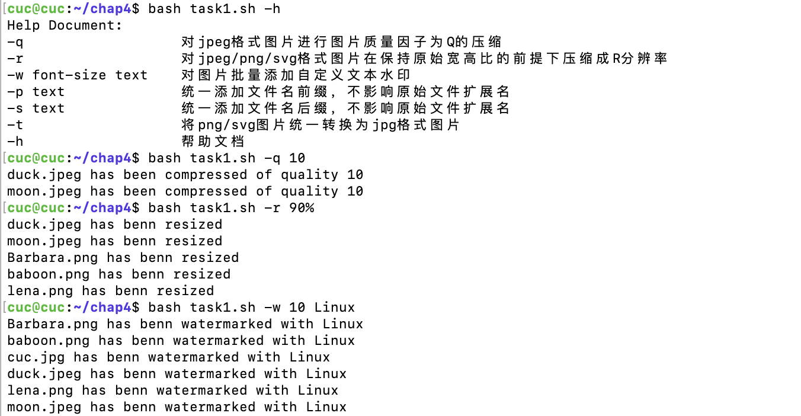
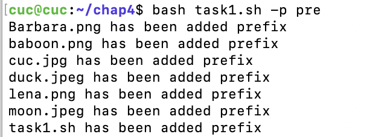
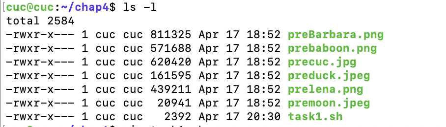
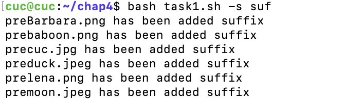
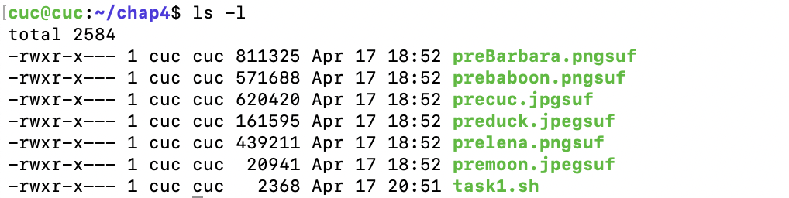
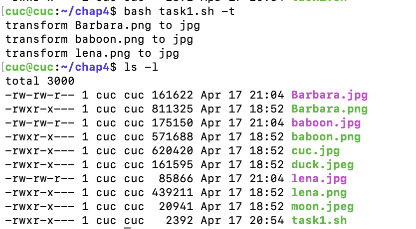

#### 任务二
1. 下载2014世界杯运动员数据tsv文件，借助scp由本地传输进虚拟机
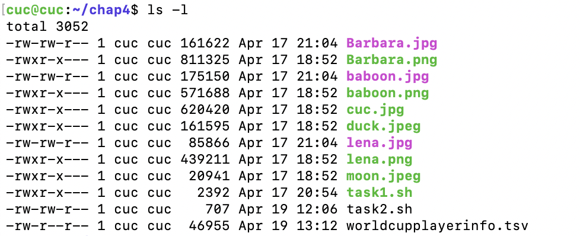

2. 编写脚本
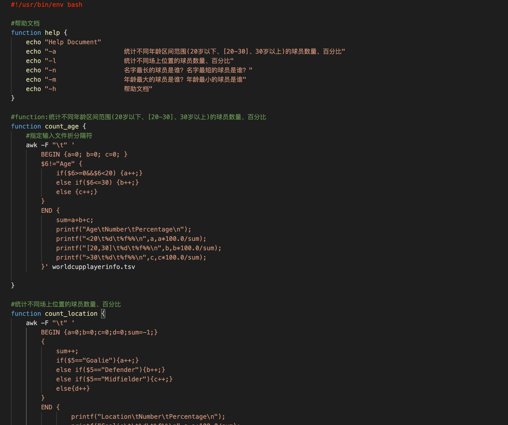

3. 测试编程结果
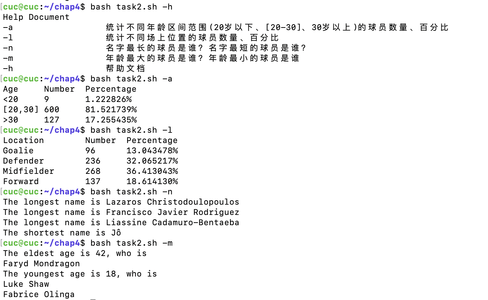

#### 任务三
1. 下载web_log.tsv文件，借助scp由本地传输至虚拟机
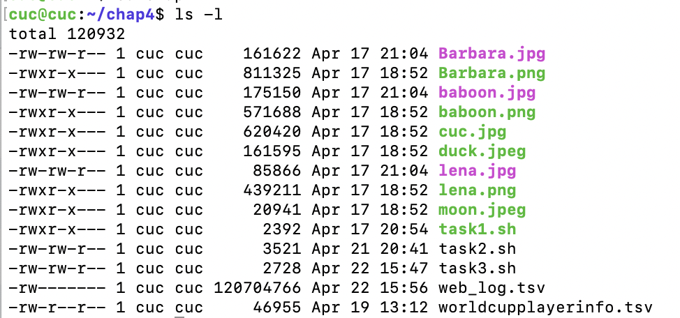

2. 编写脚本
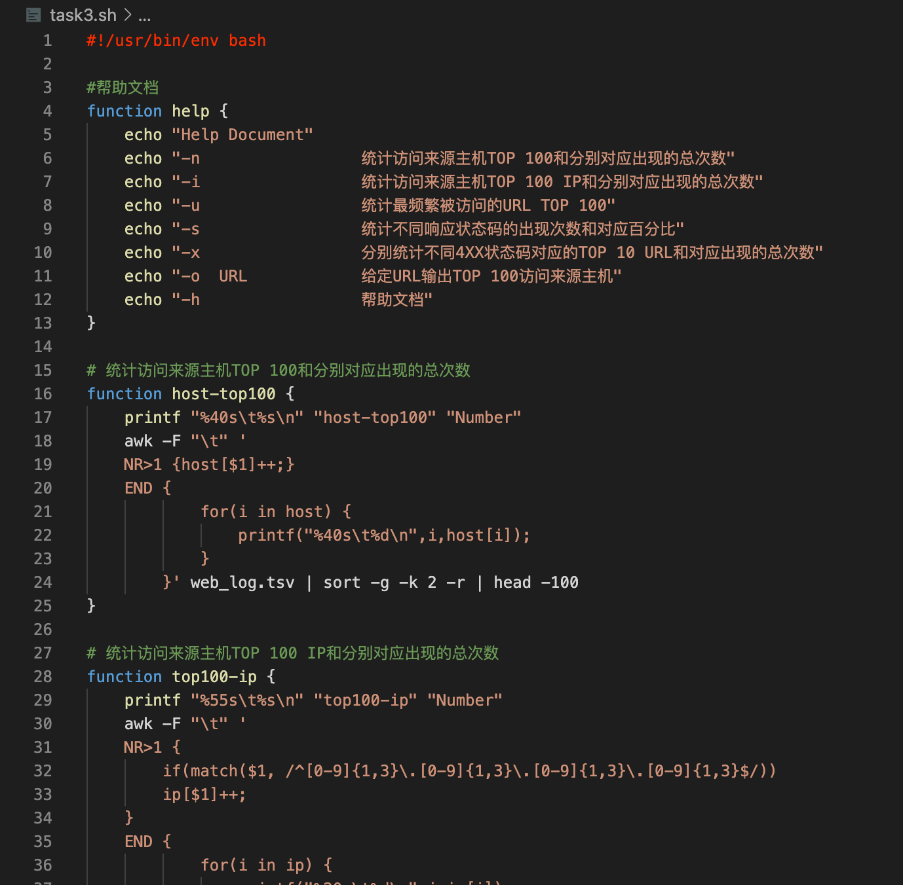

3. 测试编程结果，因为结果过长，故将结果存入result.txt，然后借助scp命令传回本机
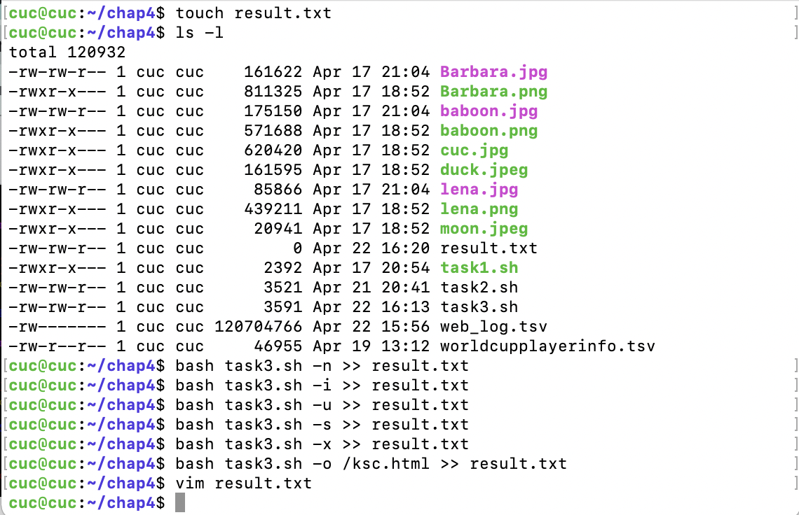

#### Travis
1. 参考老师视频，完成.travis.yml的编写
2. 安装```shellcheck```，并根据建议更改代码


## 实验问题
1. 由于实验二、实验三完成后未将虚拟机回复快照，导致虚拟机时区出现问题，以至于在无法执行```sudo apt update```命令。经过老师以及师姐的帮助才终于找到问题，将时间和时区修改正确。
2. 在下载世界杯球员数据时，出现Temporary failure in name resolution的报错，发现虚拟机网速过慢，于是直接本地下载后借助scp远程传输

## 参考文献
* [Ubutu 20.04 apt 更换国内源的实现方法](https://cloud.tencent.com/developer/article/1726035)<br/>
* [新手指南：ppa-purge的使用方法](http://blog.sina.com.cn/s/blog_40dd11e40100tqyo.html)<br/>
* [删除ppa](https://qastack.cn/ubuntu/675252/remove-ppas-add-apt-repository-remove-vs-rm-etc-apt-sources-list-d-l)<br/>
* [Ubuntu修改时区的两种方法](https://www.jianshu.com/p/9e1be6ec5c83)<br/>
* [linux-2020-cuc-Lynn](https://github.com/CUCCS/linux-2020-cuc-Lynn)<br/>
* [linux-2020-cuc-LyuLumos](https://github.com/CUCCS/linux-2020-LyuLumos)<br/>
* [awk官方文档](https://www.gnu.org/software/gawk/manual/html_node/History.html#History)
* [imagemagic使用指南](https://blog.csdn.net/wangmeitingaa/article/details/88885711)